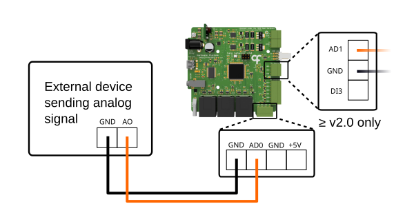
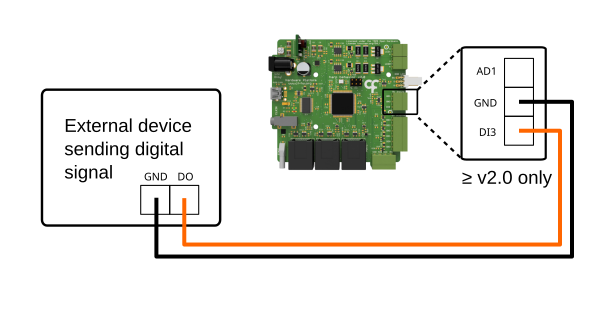
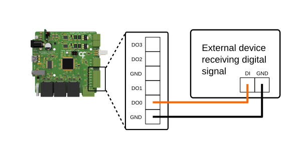
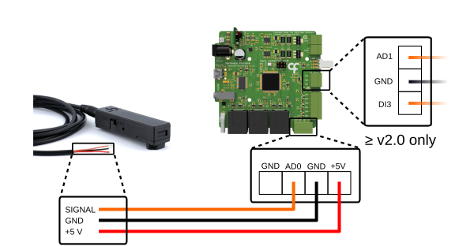
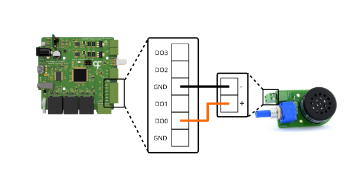
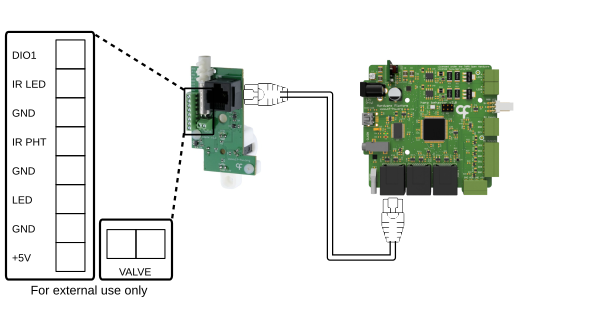
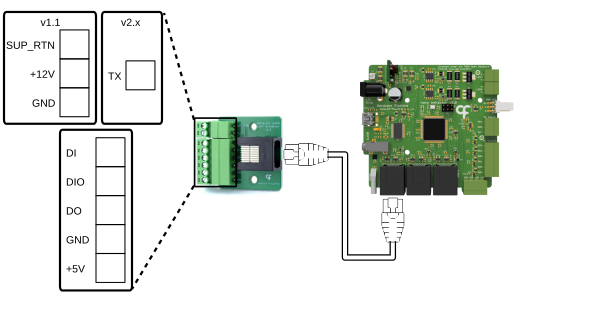

## Ports and Connections

This article will cover the ports on the Behavior board, as well as how to connect the device to peripherals and external devices.

### Ports

{width=600}

**12V PWR (Barrel Jack)** - This port powers the Behavior board and requires a 12 V power supply.

**USB (Mini-B/USB-C)** - This port connects the device to the control computer running [Bonsai](harp-bonsai.md) or the [GUI](./behavior-gui.md). The connector type depends on the [hardware version](./behavior-overview.md) of the board.

**CLKIN (Stereo Jack)** - This [Harp](https://harp-tech.org/articles/about.html) clock input accepts a clock output from any compatible Harp clock generator or synchronizer (e.g. [Harp Timestamp Generator](https://github.com/harp-tech/device.timestampgeneratorgen3)) for synchronization with other connected devices.

**STATE** - This status LED cycles on and off with a period of:
- 2 seconds when it's communicating with Bonsai
- 4 seconds when in standby
- 100 milliseconds when a catastrophic error occurs

**P0, P1, P2 (RJ45)** - These specialized peripheral ports interface directly with the [Mice Poke](./peripherals/peripherals-micepoke.md) peripheral for poke detection and reward delivery. Alternatively, use the [Breakout](./peripherals/peripherals-portbreakout.md) extension board to interface with other peripherals and accessories. Port **P2** additionally accepts the [Rotary Encoder](./peripherals/peripherals-rotaryencoder.md) peripheral for [rotation tracking](track-rotary-encoder.md).

**ADC (Screw Terminal)** - This connector carries the first analog input (**AD0**), a 5 V supply pin and two ground connections.

**Output (Screw Terminal)** - These general-purpose 5 V digital outputs can be used to communicate with external devices. **DO0**/**DO1** can generate [camera triggers](trigger-cameras.md) and **DO2**/**DO3** can drive [servo motors](drive-servos.md); all four support [PWM](generate-pwm.md).

**Input (Screw Terminal)** - This connector carries the second analog input (**AD1**), the digital input **DI3** and one ground connection. This connector is only available on hardware 2.0 and above boards.

**RGB (3-pin Flick Lock)** - Connector for up to two WS2812-type (Neopixels) addressable RGB LEDs, driven as a serial chain on a single data line. Colors are set with the [RGB registers](control-leds.md#set-rgb-colors).

**L0, L1 (Screw Terminal)** - These connectors control two regular current-controlled LED outputs. Each terminal pair is marked **A** (anode, the LED's long leg) and **K** (cathode, the short leg). The drive current is [configurable](control-leds.md) from 2 to 100 mA.

### Connections

> [!NOTE]
> Work in progress!

# [Analog Input](#tab/analoginput)

{width=600}

1. Wire the analog signal (0 – 5 V) to either **AD0** on the **ADC** connector (shown above) or **AD1** (hardware > v2.0 only) on the **Input** connector. 
2. Connect the ground wire to any **GND** pin.
3. Refer to the [Acquire Analog Data](acquire-analog-data.md) article to read the signal in Bonsai.

# [Digital Input](#tab/digitalinput)

{width=600}

1. Wire the 5 V digital signal to **DI3** on the **Input** connector (hardware 2.0 only) and its ground to any **GND** pin.
2. Alternatively, use the [Breakout](./peripherals/peripherals-portbreakout.md) board to unlock more digital inputs on the peripheral ports.
3. Refer to the [Read Digital Inputs](read-digital-inputs.md) article to visualize the input events in Bonsai.

# [Digital Output](#tab/digitaloutput)

{width=600}

1. Wire the external device's digital input to one of **DO0** – **DO3** on the **Output** connector, and connect the external device's ground to any **GND** pin.
2. Alternatively, use the [Breakout](./peripherals/peripherals-portbreakout.md) board to unlock more digital outputs on the peripheral ports.
3. Refer to the [Control Digital Outputs](control-digital-outputs.md) article to switch the output in Bonsai.

# [Photodiode](#tab/photodiode)

{width=600}

Before connecting the [Photodiode](./peripherals/peripherals-photodiode.md) peripheral, switch the jumper setting on the casing to either **ANA** for an analog reading or **DIG** for a digital output. Other third-party photodiode modules that are powered from 5 V and output a 0 to 5 V signal can also be used.

For an analog reading:

1. Wire the signal wire to either **AD0** on the **ADC** connector (shown above) or **AD1** on the **Input** connector (hardware > v2.0 only).
2. Wire the supply wire to any **+5 V** pin and the ground wire to any **GND** pin.
3. Refer to the [Acquire Analog Data](acquire-analog-data.md) article to read the light intensity as an analog reading in Bonsai.

Alternatively, for a digital output:
1. Wire the signal wire to **DI3** on the **Input** connector (hardware > v2.0 only) if you have access to it.
2. Otherwise, use the [Breakout](./peripherals/peripherals-portbreakout.md) board to unlock more digital inputs on the peripheral ports.
3. Refer to the [Read Digital Inputs](./read-digital-inputs.md) article to read the light intensity as a digital input reading in Bonsai.
4. Turn the adjustment screw to tune the light threshold for the low and high state of the digital output and monitor the response in Bonsai.

# [Speaker](#tab/speaker)

{width=600}

1. Wire the [Speaker](./peripherals/peripherals-speaker.md) peripheral to the **Output** connector: the **+** terminal to one of **DO0**–**DO3** and the **-** terminal to any **GND** pin.
2. Refer to the [Generate PWM](generate-pwm.md) article to play tones in Bonsai.

# [LED](#tab/led)

[placeholder - connection-led.svg]{width=450}

1. Wire an LED to the **L0** terminal pair: the long leg (anode) to **A** and the short leg (cathode) to **K**. No series resistor is needed; the drive current is configured in software.
2. Alternatively, connect up to two WS2812-type addressable RGB LEDs to the **RGB** connector as a serial chain.
3. Refer to the [Control LEDs](control-leds.md) article to configure and switch the LEDs in Bonsai.

# [Mice Poke](#tab/poke)

{width=600}

1. Connect the [Mice Poke](./peripherals/peripherals-micepoke.md) peripheral to port **P0**, **P1**, or **P2** with an RJ45 cable.
2. Refer to the [Control Poke Peripheral](control-poke.md) article to configure the Mice Poke peripheral in Bonsai.

# [Encoder](#tab/encoder)

[placeholder - connection-encoder.svg]{width=450}

1. Connect the [Rotary Encoder](./peripherals/peripherals-rotaryencoder.md) peripheral to port **P2** with an RJ45 cable.
2. Refer to the [Track Rotary Encoder](track-rotary-encoder.md) article to read the encoder in Bonsai.

# [Camera](#tab/camera)

[placeholder - connection-camera.svg]{width=450}

1. Wire the camera's external trigger input to **DO0** or **DO1** on the **Output** connector, and the camera's trigger ground to any **GND** pin.
2. Check that the camera's trigger input accepts a 5 V signal. For cameras with lower-voltage trigger inputs (e.g. 1.8 V or 3.3 V logic), add a level shifter between the output and the camera.
3. Refer to the [Trigger Cameras](trigger-cameras.md) article to configure and start the trigger in Bonsai.

# [Servos](#tab/servo)

[placeholder - connection-servo.svg]{width=450}

1. Connect the servo signal wire to **DO2** or **DO3** on the **Output** connector.
2. Connect the servo power wire to the 5 V pin on the **ADC** connector or [Breakout](./peripherals/peripherals-portbreakout.md) board. For servos that draw more than 200 mA, or that require a supply voltage other than 5 V, power the servo from an external supply matching its rating instead. Never connect the external supply to the board's 5 V pin; it must power the servo only.
3. Connect the servo ground wire to a **GND** pin. For servos requiring an external power supply, connect the external supply's ground to a **GND** pin.
4. Refer to the [Drive Servos](drive-servos.md) article to move the servo in Bonsai.

# [Breakout](#tab/breakout)

{width=600}

For digital input and output connections:
1. Connect a [Breakout](./peripherals/peripherals-portbreakout.md) board to port **P0**, **P1**, or **P2** with an RJ45 cable.
2. Wire the signal wire from external devices to the **DI**, **DIO**, and **DO** screw terminals.
3. Wire the **+5V** pin and **GND** pins to provide power and ground.
4. Refer to the [Read Digital Inputs](read-digital-inputs.md) and [Control Digital Outputs](control-digital-outputs.md) articles to use these lines in Bonsai.

For valve control (v1.1 only):
1. Wire a 12 V solenoid valve between the **+12V** and **SUP_RTN** terminals.
2. Refer to [Deliver Rewards on Poke](control-poke.md#deliver-rewards-on-poke) to pulse the valve line in Bonsai.

For streaming the serial timestamp (v2.x only):
1. Connect the board to **P2**, the timestamp stream can only be transmitted on this port.
2. Wire the **TX** terminal to the receiving device's **RX** input or to a logged digital input and a **GND** terminal to its ground.
3. Set the board's logic-level jumper to match the receiver's operating voltage level (3.3 V or 5 V).
4. Refer to the [Stream Timestamps](advanced-configuration.md#stream-timestamps) section to enable the stream in Bonsai.

# [Harp Synchronization](#tab/harpsynchronization)

[placeholder - connection-harpsynchronization.svg]{width=450}

1. Connect a clock output of a Harp clock generator (e.g. the [Harp Timestamp Generator](https://github.com/harp-tech/device.timestampgeneratorgen3)) to the **CLKIN** jack with a stereo jack cable.
2. The Behavior board adopts the generator's clock automatically. To verify the connection, check that the **STATE** LEDs of the connected boards blink simultaneously.
3. Refer to the [Harp synchronization clock](https://harp-tech.org/protocol/SynchronizationClock.html) documentation for how devices synchronize.

---

[!INCLUDE ]
